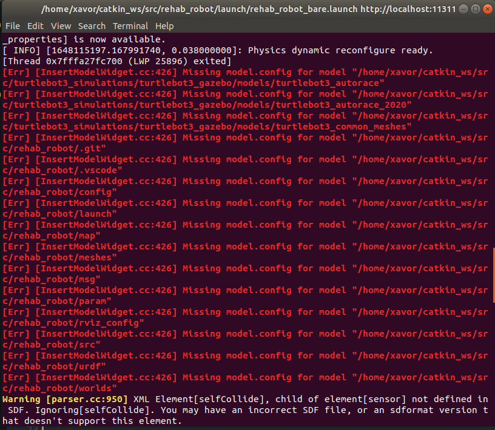
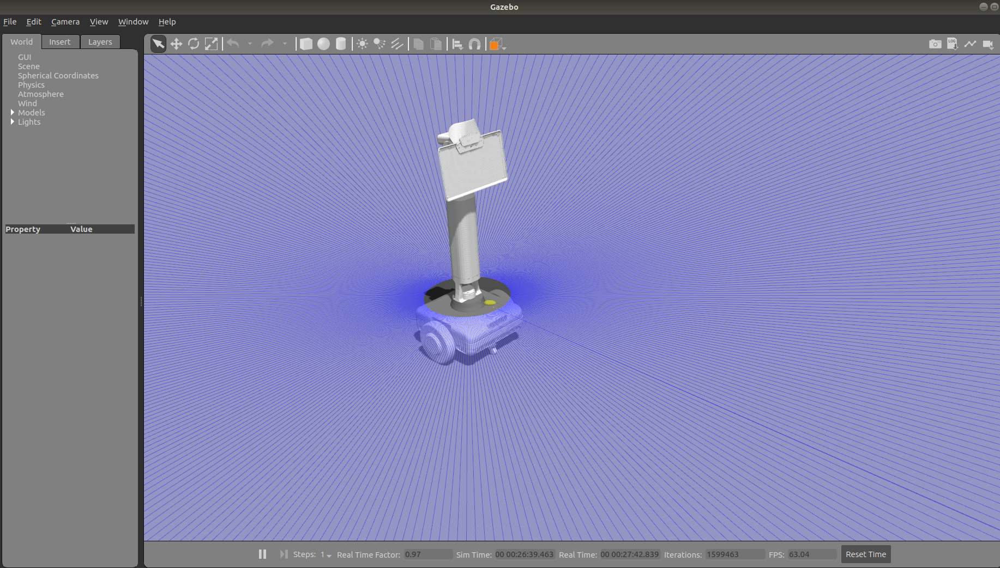
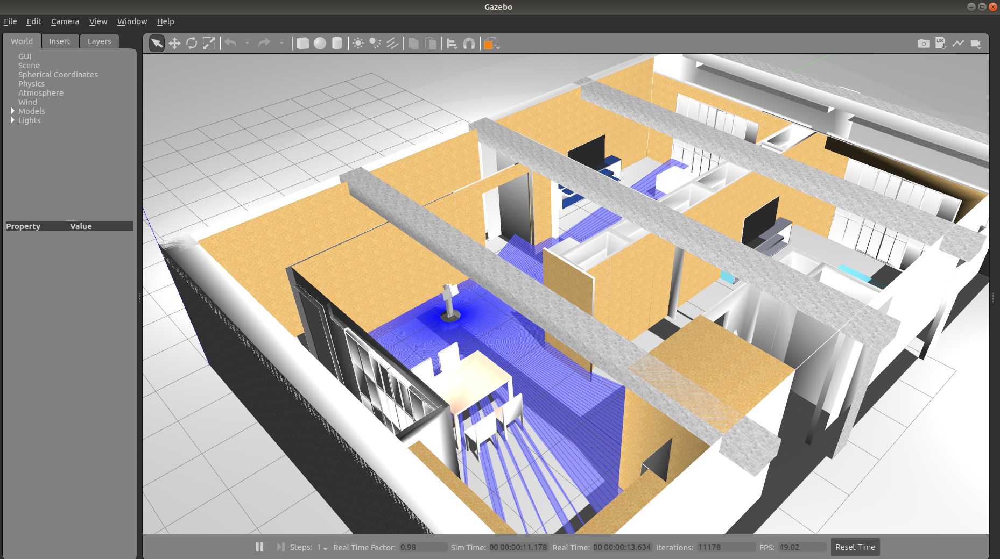
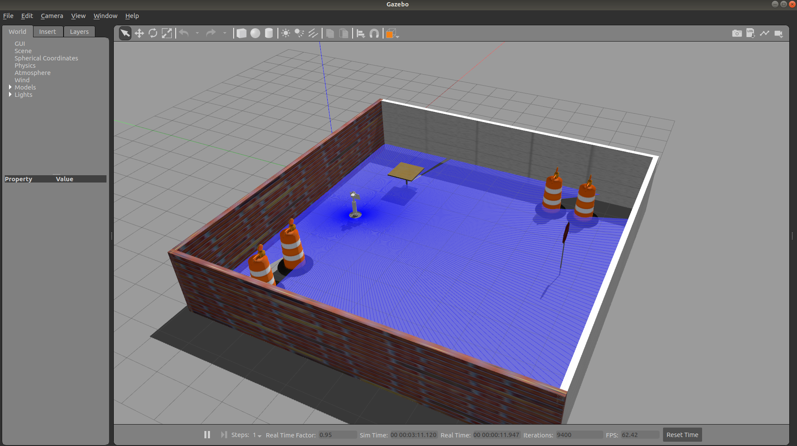
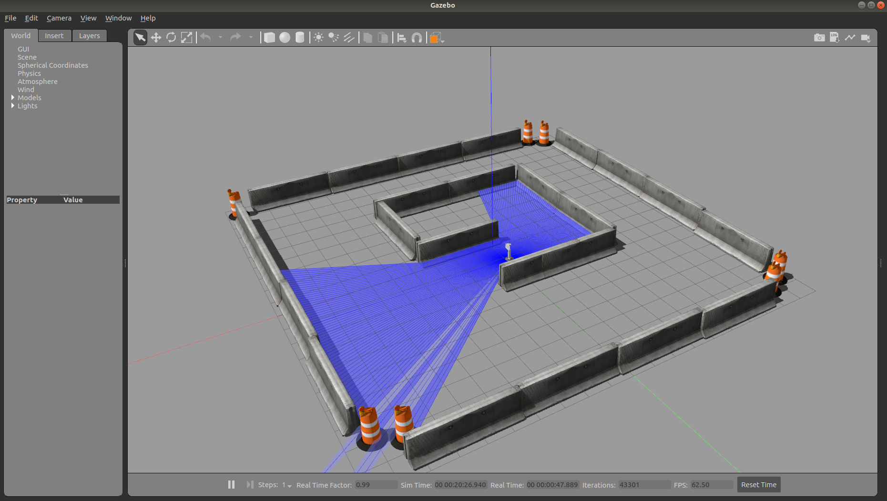

## Overview
This repository contains the Gazebo-ROS simulation of MRR robot being developed at [Xavor Coorporation](https://www.xavor.com). The aim of this simualtion is to replicate the actual robot in nearly every means to test navigation and other different enviorment scenerios. [Gazebo](http://gazebosim.org/) is used as the simulator due to its verstile use in robotics and its integration ease with [ROS](https://www.ros.org/). 


## Pre-Requisites

1. __ROS Melodic__

   Follow the instructions [here](http://wiki.ros.org/melodic/Installation/Ubuntu) for complete ROS-Melodic installation.

2. __Gazebo 9.0__
   
   This simulation has been created on Gazebo (9.19.0) version. Use the same version for avoiding any confilicts with packages and model file. Installation instructions can be followed [here](http://gazebosim.org/tutorials?cat=install&tut=install_ubuntu&ver=9.0).

3. __Gazebo-ROS-Packages__
  
    On top of Gazebo, the Gazebo-ROS-Packages are essentially needed for this simulation. The serve as a brigde between *ROS* and *Gazebo*. Installtion and working instructions can be followed [here](https://gazebosim.org/tutorials?tut=ros_installing&cat=connect_ros).

## Setup 

1. Clone the complete project into your workspace ```src``` folder: 
   
   ```git clone https://github.com/Xavorcorp/Embd_MRR-Simulation.git```

2. Compile everything using: 
   
   ```catkin_make```


## Usage 

This project spawns the Rehab Robot in various scenerios. The basic standalone simulation of robot along with the different worlds are discussed below. 

  ### Standlone Simulation 

  Run the following launch file to spawn the Rehab Robot in Gazebo environment.

  ```roslaunch rehab_robot rehab_robot_bare.launch```

  Make sure no errors are there no errors appearing on the terminal other than the ones shown below. These errors have no linkages with simulation. They will be removed in next update to the package.

    

After this step, you should see the robot spawned in Gazebo like the one shown below. 

  

You can list the rostopics using ```rostopic list``` in terminal to see all robot related topics. Use *RVIZ* to see the data coming on various topics including laser scanner, Camera, sensors & other sensors. If this step succeeds without any errors, the robot spawing is being done properly and the sensors are correctly working. 

### Worlds

There are various world files available to spawn and test the robot for various navigation scenerios. The main world file is the living lab enviornmet. Run the following: 

```roslaunch rehab_robot spawn_in_living_lab.launch```

You should see the following output on *Gazebo*.



Similarly, other worlds can be run by the following commands (outputs shown below):

```roslaunch rehab_robot spawn_in_square_room.launch```



```roslaunch rehab_robot spawn_in_maze.launch ```


   
### Teleoperation of Robot

The robot can be moved around using the teleop node. Run the following node to move around the robot in different environments. 

```rosrun teleop_twist_keyboard teleop_twist_keyboard.py```


<!-- ## Contact
**Author:** Ali Ahmad  <br/>
**Designation:** Senior Robotic Engineer <br/>
**Email:** ali.ahmad@xavor.com <br/>
 -->
