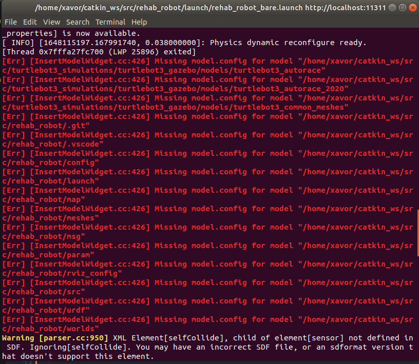
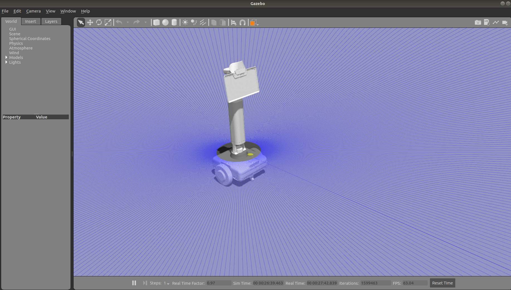
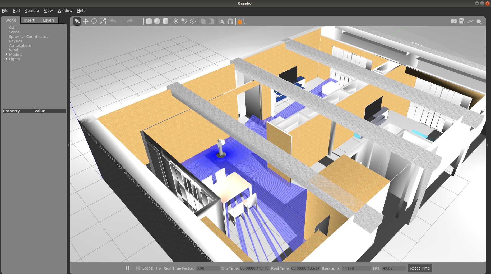
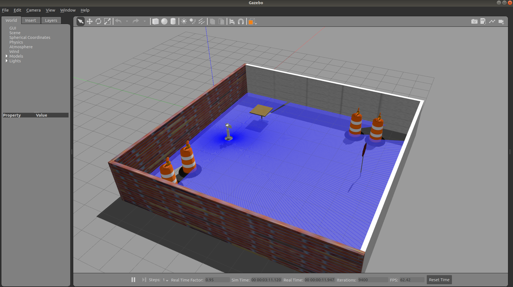
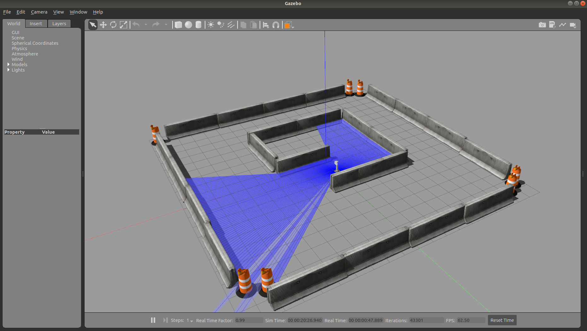
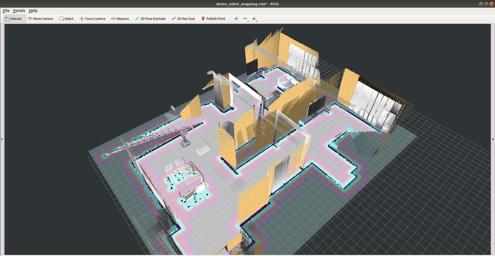
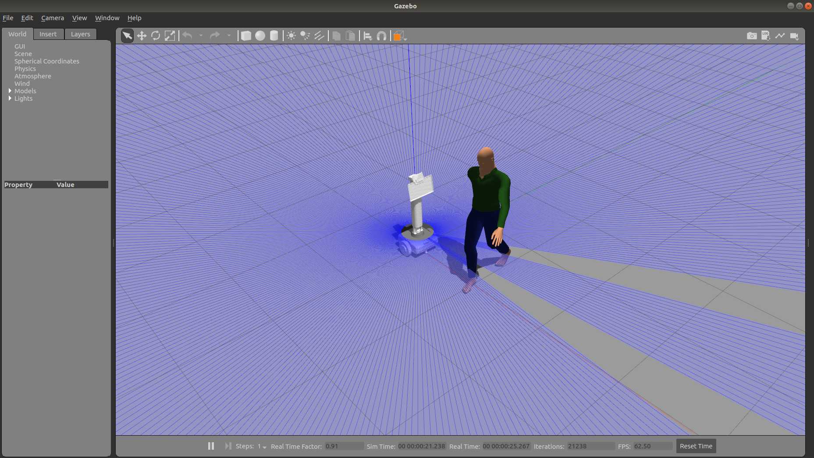

# Simulation Overview 

This repository contains the Gazebo-ROS simulation of MRR robot being developed at [Xavor Coorporation](https://www.xavor.com). The aim of this simualtion is to replicate the actual robot in nearly every means to test navigation and other different enviorment scenerios. [Gazebo](http://gazebosim.org/) is used as the simulator due to its verstile use in robotics and its integration ease with [ROS](https://www.ros.org/). 


## Pre-Requisites

1. __ROS Melodic__

   Follow the instructions [here](http://wiki.ros.org/melodic/Installation/Ubuntu) for complete ROS-Melodic installation.

2. __Gazebo 9.0__
   
   This simulation has been created on Gazebo (9.19.0) version. Use the same version for avoiding any confilicts with packages and model file. Installation instructions can be followed [here](http://gazebosim.org/tutorials?cat=install&tut=install_ubuntu&ver=9.0).

3. __Gazebo-ROS-Packages__
  
    On top of Gazebo, the Gazebo-ROS-Packages are essentially needed for this simulation. The serve as a brigde between *ROS* and *Gazebo*. Installtion and working instructions can be followed [here](https://gazebosim.org/tutorials?tut=ros_installing&cat=connect_ros).

4. __RTAB-MAP__
   
   The mapping/ navigation has been implementated using RTAB-MAP. See the [instruction](https://github.com/introlab/rtabmap_ros) to properly install the package before setting up the simulation.

5. __Move-Base Package__
   
   The navigation of robot has been done using the ```move_base``` package. See the [instructions]() for complete guide. Run the following command for installation. 

   ```sudo apt-get install ros-melodic-move-base*```


## Setup 

1. Clone the complete project into your workspace ```src``` folder: 
   
   ```git clone https://github.com/Xavorcorp/Embd_MRR-Simulation.git```

2. Compile everything using: 
   
   ```catkin_make```


## Usage 

This project spawns the Rehab Robot in various scenerios. The basic standalone simulation of robot along with the different worlds are discussed below. 

  ### Standlone Simulation 

  Run the following launch file to spawn the Rehab Robot in Gazebo environment.

  ```roslaunch rehab_robot rehab_robot_bare.launch```

  Make sure no errors are there no errors appearing on the terminal other than the ones shown below. These errors have no linkages with simulation. They will be removed in next update to the package.

   <!--  -->
    

After this step, you should see the robot spawned in Gazebo like the one shown below. 

  

You can list the rostopics using ```rostopic list``` in terminal to see all robot related topics. Use *RVIZ* to see the data coming on various topics including laser scanner, Camera, sensors & other sensors. If this step succeeds without any errors, the robot spawing is being done properly and the sensors are correctly working. 

### Worlds

There are various world files available to spawn and test the robot for various navigation scenerios. The main world file is the living lab enviornmet. Run the following: 

```roslaunch rehab_robot spawn_in_living_lab.launch```

You should see the following output on *Gazebo*.



Similarly, other worlds can be run by the following commands (outputs shown below):

```roslaunch rehab_robot spawn_in_square_room.launch```



```roslaunch rehab_robot spawn_in_maze.launch ```


   
### Teleoperation of Robot

The robot can be moved around using the teleop node. Run the following node to move around the robot in different environments. 

```rosrun teleop_twist_keyboard teleop_twist_keyboard.py```


## RTAB-Map Based Mapping/ Navigation

The basic mappinga and navigation has been implemented on the robot using the [RTAB-MAP](http://wiki.ros.org/rtabmap_ros). Detailed information on setting up mapping and navigation using RTAB-Map can be seen [here](http://wiki.ros.org/rtabmap_ros/Tutorials/SetupOnYourRobot)

### Mapping the Environment

Launch any of the above described world file to start the mapping. After that launch the mapping using:

```roslaunch rehab_robot rtab_mapping.launch```

Move the robot in the environment using teleop node to create the map of the area. 

### Running the Navigation

Once mapping has been done, the next step is navigate the robot autonomously. Run the navigation file using:

```roslaunch rehab_robot rtab_navigation.launch```

Then, run the ```move_base``` launch file for moving the robot inside the area. Details on ```move_base``` can be found [here](http://wiki.ros.org/move_base).

```roslaunch rehab_robot rtab_move_base.launch```

After successsfully launching both files, you should see the following result.



Provide the goal from ```RVIZ``` goal menu. The robot will be able to navigate inside the map area. 


## Under Development Work 

### Adding an Actor in the Simulation

This work was done in order to animate an actor inside the above developed simulation. The aim was to somehow model the elderly person inside the living lab area and then test the navigation algorithms and the mobility index calculation algorithms being developed by the AI team. This work is still under progress and has not been used anywhere to test due to extensive work required in simulating the animation of person in various styles. 

Launch the below mentioned file to see the actor spawing inside Gazebo. Further complete details on spawing an actor and modeling etc can be found [here](http://gazebosim.org/tutorials?tut=actor&cat=build_robot).


```roslaunch rehab_robot spawn_actor.launch```




### Gmapping Implementation for Navigation

Apart from RTAB-Map based mapping/ navigation, Gmapping based navigation is also being developed for evaluation of both techniques. This work is still not complete. Will be update soon. Details on Gmapping can be found [here](http://wiki.ros.org/gmapping).


### Person Location/ Time Tracking Inside Map

This work is similar to the work described [here](https://github.com/aliahmadXVR/rehab_person_loc). The aim is to find the location of robot and person inside the map while navigating and also to calcuate the duration the person spends at various areas inside the map. This work has been implemented [here](https://github.com/aliahmadXVR/rehab_person_loc) and tested on actual robot. It will be 
availble to test in simulation soon. 

___
<br/><br/>
## Contact   
**Author:** Ali Ahmad  <br/>
**Designation:** Senior Robotics Engineer <br/>
**Email:** ali.ahmad@xavor.com <br/>

